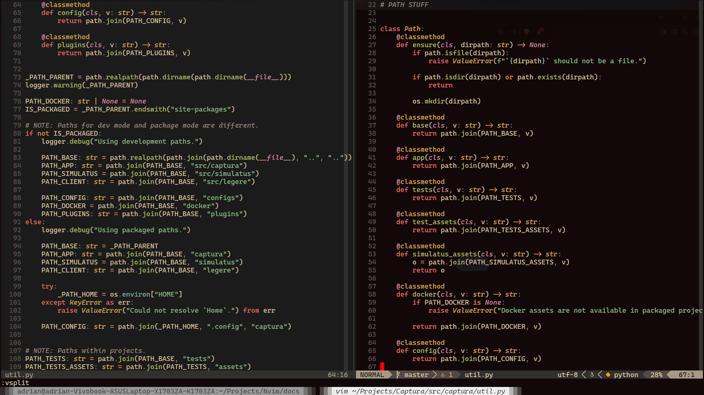

# Nvim Configuration


Thank you to
[quarto-nvim-kickstarter](https://github.com/jmbuhr/quarto-nvim-kickstarter)
for giving me some ideas where to start with nvim! This is a mix of the
kick-starter and my already existing configuration.

## Features

- Completion, fixing, syntax, and diagnostics in standalone files within
  [quarto](https://github.com/quarto-dev/quarto-nvim) and `markdown`
  code blocks for `python`, `go`, `lua`, `javascript`, `julia`, `r`,
  `markdown`, `yaml` and `json` using

  - [cmp](https://github.com/hrsh7th/nvim-cmp) for completion.
  - [quarto.nvim](https://github.com/quarto-dev/quarto-nvim) and
    [otter.nvim](https://github.com/jmbuhr/otter.nvim) for quarto
    highlighting and injected syntax.
  - [conform.nvim](https://github.com/stevearc/conform.nvim) for fixing
    bad formatting.

- Nice highlighting for `mermaid` and `dot` diagrams in `markdown` and
  `quarto`.

- Comment toggling and untoggling with
  [comment.nvim](https://github.com/numToStr/Comment.nvim).

- Git integration with
  [diffview](https://github.com/sindrets/diffview.nvim).

- Nice statusbar with
  [lualine](https://github.com/acederberg/nvim-lualine/lualine.nvim).

- Whitespace trimming and highlighting with
  [whitespace.nvim](https://github.com/johnfrankmorgan/whitespace.nvim).

- My favorite colorschmes including
  [kanagawa](https://github.com/rebelot/kanagawa.nvim),
  [gruvbox](https://github.com/sainnhe/gruvbox-material), an
  [solarized](https://github.com/maxmx03/solarized.nvim).

## Installation

The following instructions assume that you have successfully installed a
recent version of `nvim`. If you want to use this in entirety and want
to do nothing else do

``` sh
mdkir ~/.config/nvim
git clone <repo_url> ~/.config/nvim
echo "source ~/.config/nvim/<repo-name>/init.lua" >> init.lua
```

## Screenshots

#### Highlighting `python` code blocks and `yaml` front matter in quarto documents.


#### Highlighting `mermaid` diagram syntax inside of `quarto`.


#### Lua with `cmp.nvim` feedback.


#### Python code highlighting.


